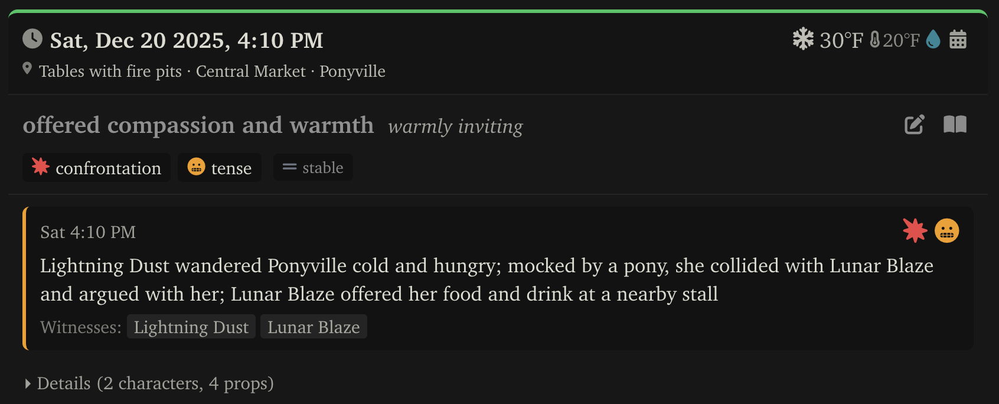
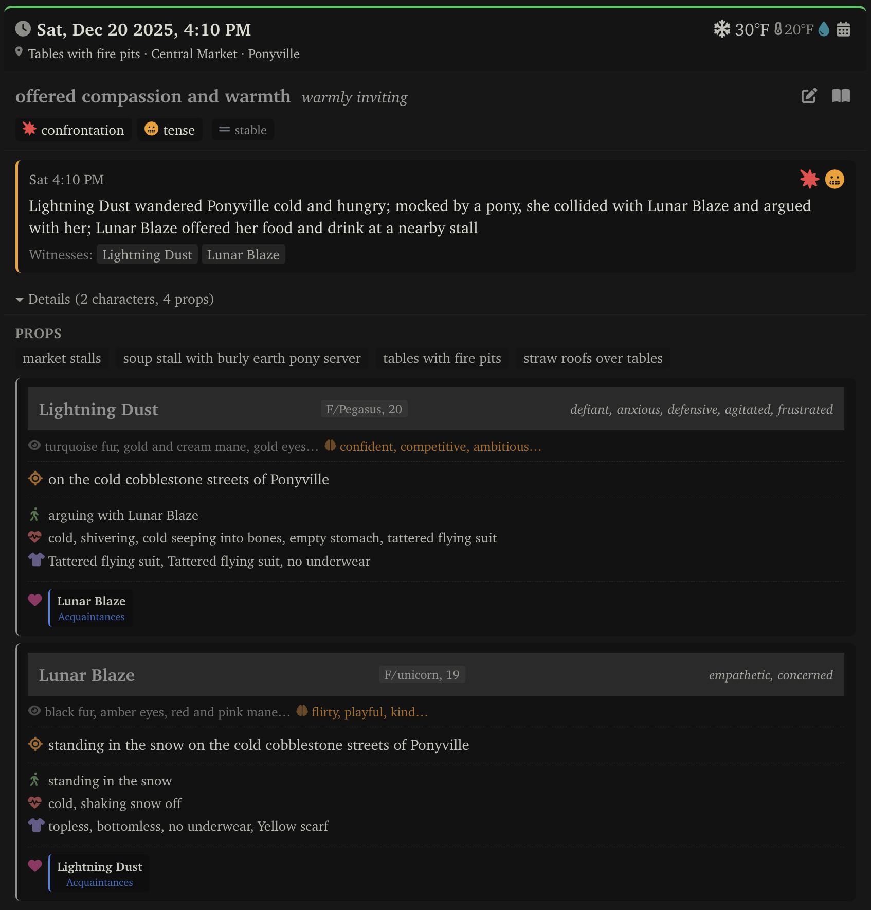
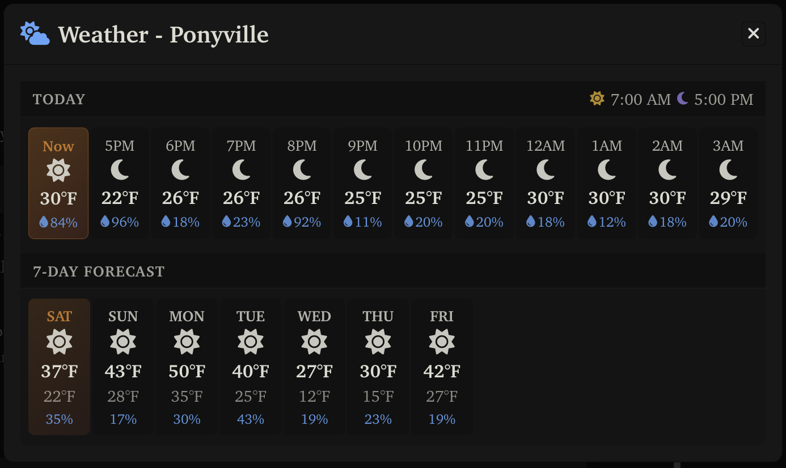
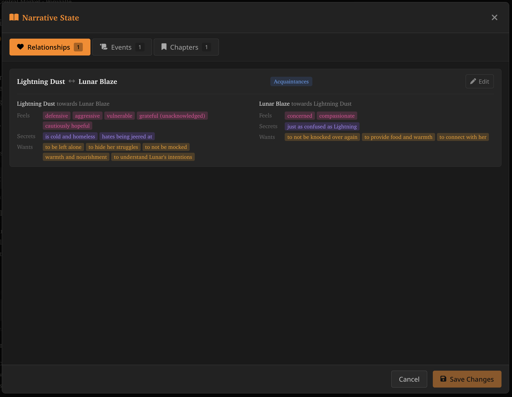
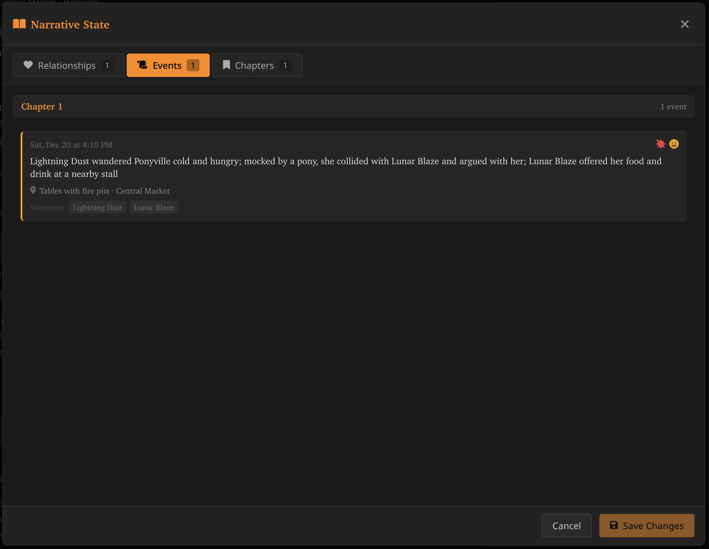
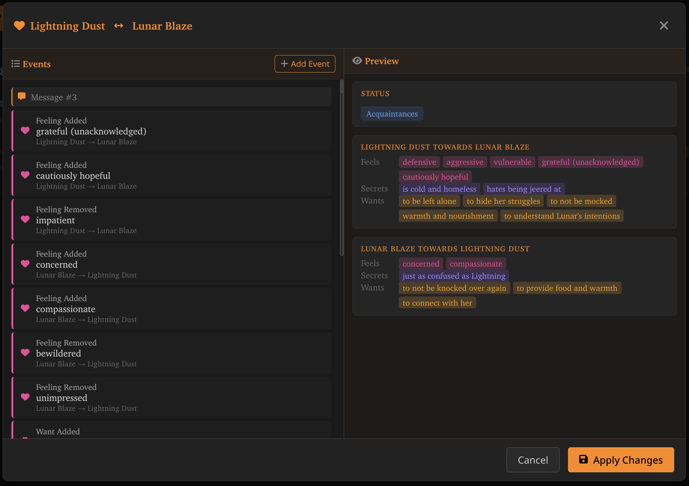
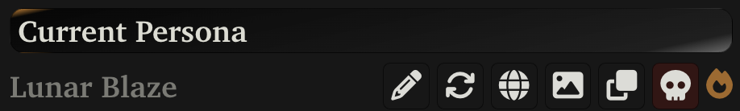
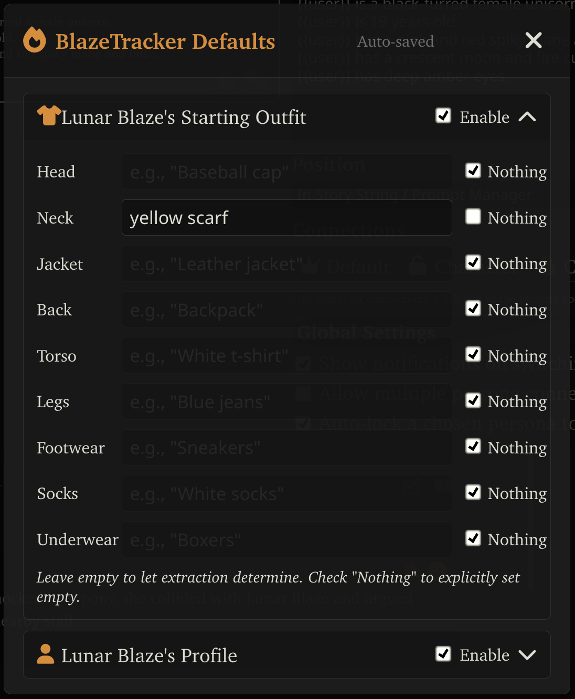
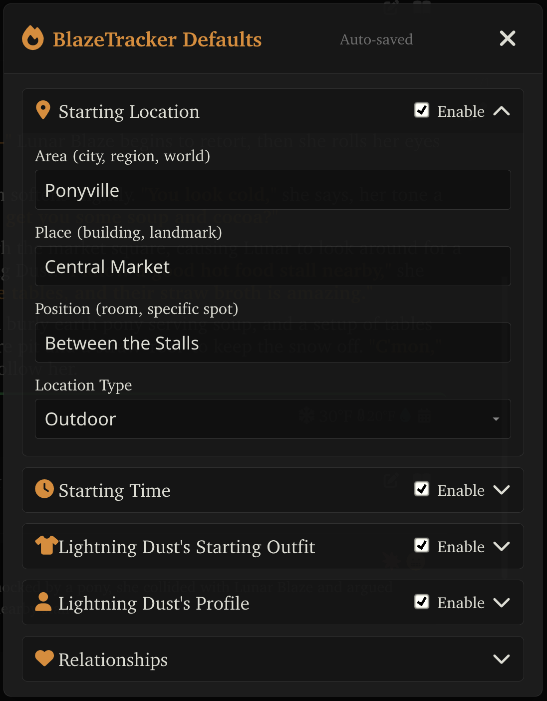

# BlazeTracker 🔥

A SillyTavern extension that tracks narrative state across roleplay conversations — time, weather, locations, characters, outfits, relationships, and story progression — and injects it back into context to maintain consistency.

Built for longer, slower-burn narratives. Prioritises accuracy over speed.



### Is This For You?

**Yes if:** You want deep state tracking, run capable models (Gemma 3 27B+), and don't mind multiple LLM calls per message.

**No if:** You want something lightweight, run small models, or need minimal latency. Try [wTracker](https://github.com/bmen25124/SillyTavern-WTracker) instead.

---

## Installation

### Requirements

- SillyTavern 1.12.0 or later
- Git installed on your system
- A capable LLM (Gemma 3 27B is roughly the minimum for reliable extraction)

### Install via SillyTavern

1. Open SillyTavern
2. Go to **Extensions** → **Install Extension**
3. Paste the repository URL:
   ```
   https://github.com/lunarblazepony/BlazeTracker
   ```
4. Click **Install**
5. Reload SillyTavern

### Manual Installation

1. Navigate to your SillyTavern installation
2. Go to `data/<user>/extensions/` (or `public/scripts/extensions/third-party/` for all users)
3. Clone the repository:
   ```bash
   git clone https://github.com/lunarblazepony/BlazeTracker
   ```
4. Restart SillyTavern

---

## Setup

### Connection Profile

BlazeTracker needs a connection profile to make extraction calls separately from your main chat.

1. Open the connection menu in SillyTavern
2. Click **Add** at the top — this will auto-populate settings from your current connection
3. **Important:** Uncheck "Start reply with" if you have it configured for roleplay
4. Refresh the page (new profiles don't appear in Extensions until you reload)
5. Select your new profile in the BlazeTracker settings panel

### Enable Prefix Caching (Recommended)

BlazeTracker makes multiple sequential LLM calls per message. Prefix caching lets your backend reuse the computed context between calls, significantly reducing latency and compute.

**KoboldCpp**

```bash
# Add to your launch command
--smartcache 18
```

The number is how many cache slots to allocate. Each slot stores a full context's worth of KV cache in system RAM (not VRAM), so memory usage scales with context length and model size. You need at least 12 slots to see meaningful benefit; fewer than that and the cache churns too quickly to help.

Memory usage varies significantly by model: 18 slots with GLM 4 358B at full context uses ~200GB RAM, while the same setup with QwQ 32B uses ~48GB. Check your system memory before going too high.

**Aphrodite**

```bash
# Add to your launch command
--enable-prefix-caching
```

**vLLM**

```bash
# Add to your launch command
--enable-prefix-caching
```

**TabbyAPI**

In your `config.yml`:
```yaml
cache:
  prompt_cache: true
```

**llama.cpp / llama-server**

```bash
# Add to your launch command
--cache-prompt
```

---

## Features

### Compact Message Block


Each message displays a compact state summary: date and time, location, weather conditions (with temperature and humidity), scene topic and tone, tension (type, level, and direction), and the three most recent narrative events.

**Toolbar buttons:**
- 📅 **Calendar** (next to weather) — Opens the weather forecast modal
- 🔥 **Fire** — Re-extract state for this message
- ✏️ **Edit** — Open the event editor for this message
- 📖 **Book** — Open the narrative state modal

### Detailed Message Block



Expand "Details" to see the full scene state: nearby props and complete character cards for everyone present. Each character card shows their position, current activity, mood, physical state, detailed outfit, and their relationship status with other characters in the scene.

### Weather Forecast



Click the 📅 icon to open the weather forecast for the current location. Shows hourly conditions for today (with sunrise and sunset times) and a 7-day forecast with highs, lows, and precipitation chance. All procedurally generated from real climate data — no LLM calls required.

### Narrative State Modal

Click the 📖 button to open the Narrative State modal with three tabs:

#### Relationships



Bidirectional relationship tracking between character pairs. Each side shows what that character feels, knows (secrets), and wants regarding the other. Status levels range from strangers through to intimate. Click Edit to open the relationship editor.

#### Events



Story events organised by chapter. Each event shows its timestamp, a narrative summary, location, tension indicators, and which characters witnessed it. These are the high-level beats of your story.

#### Chapters


View chapters with a tension-over-time graph showing how the emotional intensity has progressed. The Y-axis uses tension level icons (from relaxed ☕ up through volatile 🔥) so you can see the shape of your story at a glance.

### Relationship Editor



The relationship editor shows the full event history for a character pair — feelings added, feelings removed, wants changed, status shifts — organised by message. The right panel shows a live preview of the current relationship state as projected from those events. Add, edit, or remove relationship events to correct the tracker's interpretation of how characters feel about each other.

### Event Editor


Click the ✏️ button on any message to open the event editor. The left panel shows all events extracted from that message, organised by type:

- **Time Events** — Time deltas applied to the projection (e.g., "+2m", "+1h 30m", "+2d")
- **Character Events** — Activity changes, position changes, outfit changes
- **Relationship Events** — Status changes, arguments, milestones

The right panel shows a live preview of the resulting state. Add, edit, or remove events and see how it affects the tracked state before saving.

### Character Defaults

BlazeTracker lets you pre-configure starting state for both your persona and AI character cards. This means the tracker knows what to expect from the first message — no need to manually correct initial assumptions.

#### Persona Defaults



Click the 🔥 button in the Persona panel to configure your character's defaults:



- **Starting Outfit** — Set what you're wearing by body slot (head, neck, torso, etc.). Check "Nothing" to explicitly mark a slot as empty; leave blank to let extraction determine it.
- **Profile** — Sex, species, and other character details.

Settings are saved to the extension and apply to all chats using this persona.

#### Character Card Defaults


Click the 🔥 button in the Character panel to configure an AI character's defaults:



- **Starting Location** — Area, place, position, and whether it's indoor/outdoor.
- **Starting Time** — When the scene begins.
- **Starting Outfit** — Same body slot system as personas.
- **Profile** — Character details.
- **Relationships** — Initial relationship states with other characters.

These settings are saved to the character card's extension data — if you share the card with another BlazeTracker user, your defaults work for them automatically. Non-BlazeTracker users simply ignore the extra data.

### STScript Commands

BlazeTracker provides commands for automation and batch operations:

| Command | Description |
|---------|-------------|
| `/bt-extract` | Extract state for the most recent message |
| `/bt-extract-remaining` | Extract state for all messages since the last extraction |
| `/bt-extract-all` | Clear all state and re-extract the entire chat from scratch |
| `/bt-event-store` | Open a modal showing all events in the event store |

---

## Settings

Open the BlazeTracker settings panel in SillyTavern's Extensions menu.

### Connection

**Connection Profile** — Select which API connection to use for state extraction. See [Setup](#setup) for how to create one.

**Auto Extract** — When enabled, automatically extract state from new messages. Disable for manual-only extraction via the 🔥 button.

### Display

**State Display Position** — Show the state block above or below the message content.

**Temperature Unit** — Display temperatures in Fahrenheit or Celsius.

**Time Format** — Display time in 12-hour (2:30 PM) or 24-hour (14:30) format.

### Tracking

Enable or disable specific extraction modules. Disabling modules you don't need reduces LLM calls per message.

| Module | What it tracks |
|--------|----------------|
| **Time** | Narrative date and time |
| **Location** | Area, place, and position |
| **Props** | Nearby objects and items (requires Location) |
| **Climate** | Weather and temperature (requires Location and Time) |
| **Characters** | Positions, moods, and outfits |
| **Relationships** | Character relationships and attitudes (requires Characters) |
| **Scene** | Topic, tone, and tension |
| **Narrative** | Events, milestones, and chapters (requires Relationships and Scene) |

**Debug Logging** — Log debug information to browser console. Useful for troubleshooting extraction issues.

### Custom Prompts

Override the default extraction prompts for any module. Each prompt has:

- **Temperature** — LLM temperature for this extraction (lower = more deterministic, higher = more creative). Shows both the category default and per-prompt default.
- **Available Placeholders** — Variables you can use in the prompt (e.g., `{{messages}}`, `{{characterName}}`).
- **System Prompt** — Static instructions, cacheable by LLM providers for prefix caching.
- **User Template** — Dynamic content with placeholders, changes per extraction.

Prompts are available for initial extraction (first message) and delta extraction (subsequent messages) across all tracked categories.

### Advanced Settings

**Category Temperatures** — Set default temperatures per extraction category. Individual prompts can override these.

| Category | Default | Notes |
|----------|---------|-------|
| Time | 0.3 | Low for deterministic time parsing |
| Location | 0.5 | |
| Props | 0.5 | |
| Climate | 0.3 | Low for consistent weather |
| Characters | 0.5 | |
| Relationships | 0.6 | Slightly higher for nuanced feelings |
| Scene | 0.5 | |
| Narrative | 0.6 | Slightly higher for creative summaries |

---

## Troubleshooting

### Initial state is wrong

The first extraction makes assumptions based on limited context. This is normal.

**Fix:** Edit the events on the first assistant message using the ✏️ button. Set the correct time, location, outfits, and relationships. All subsequent extractions will project forward from your corrections.

### Extraction isn't accurate

Different models respond differently to prompts.

**Fix:** Open Custom Prompts in settings and tune the prompts for your model. Add more explicit instructions, adjust field descriptions, or lower temperatures for more deterministic output.

### Extraction is still inaccurate after tuning

BlazeTracker needs a capable model to reliably follow structured extraction prompts.

**Fix:** Use a larger model. Gemma 3 27B is roughly the minimum for consistent results. If your model can't handle it, no amount of prompt tuning will help.

### Extraction is too slow

BlazeTracker makes multiple sequential LLM calls per message.

**Fix:** Enable prefix caching in your backend (see [Installation](#enable-prefix-caching-recommended)). This lets repeated context be reused across calls.

### Extraction is still slow with prefix caching

You may be tracking more than you need.

**Fix:** Disable tracking modules you don't care about in Settings → Tracking. Each disabled module is one fewer LLM call per message.

### Extraction is still too slow

BlazeTracker prioritises accuracy over speed. If latency is a dealbreaker, this may not be the right tool for you.

**Fix:** Try [wTracker](https://github.com/bmen25124/SillyTavern-WTracker) instead. It's lighter weight and designed for simpler use cases.

---

## Support &amp; Feedback

We have an active thread on the [SillyTavern Discord](https://discord.gg/sillytavern), under Resource Forums > extensions.

---

## Architecture

### Event-Sourced State

BlazeTracker doesn't store absolute state at each message. Instead, it stores *events* — time passed, character moved, outfit changed, feeling added — and projects current state by replaying them.

This means:
- Editing an early event automatically updates all downstream state
- Rolling back (swiping, regenerating) cleanly removes events from that point forward
- Relationships have full version history — you can see what any relationship looked like at any point

Events are stored per-message. Narrative state (chapters, relationships) lives in message 0 and accumulates across the conversation.

### Extraction Pipeline

Extractors run in sequence, each feeding context to the next:

1. **Time** — Extracts time delta from the message
2. **Location** — Extracts area, place, position
3. **Props** — Extracts nearby objects (knows the location)
4. **Climate** — Simulates weather (knows the location and time)
5. **Characters** — Extracts character states and outfits
6. **Relationships** — Updates feelings, wants, secrets (knows who's present)
7. **Scene** — Extracts topic, tone, tension
8. **Narrative** — Extracts story events, detects chapter breaks (knows relationships and tension)

Not all extractors run on every message. Initial extraction (first message) uses different prompts than delta extraction (subsequent messages). Some extractors only run on assistant messages where both sides of the conversation are available.

### Procedural Weather

Weather isn't extracted from scene descriptions — it's simulated.

1. **Location Mapping** — The LLM classifies whether a location is real or fictional. Real locations are geocoded. Fictional locations are mapped to real-world climate analogs (Winterfell → Reykjavik) or base climate types (temperate, desert, arctic, etc.).

2. **Climate Normals** — For real locations, historical climate data is fetched from Open-Meteo. For fictional locations, fallback profiles provide monthly temperature ranges, precipitation patterns, and condition probabilities.

3. **Forecast Generation** — A deterministic 28-day forecast is generated using seeded RNG, producing realistic day-to-day variation based on climate normals.

4. **Hourly Lookup** — Given a narrative date and time, the system looks up temperature, humidity, precipitation, cloud cover, and wind from the forecast. Indoor locations adjust temperature based on building type.

The result: weather that's internally consistent across your story without burning tokens asking the LLM to make it up.

### Prefix Caching

Extraction prompts are split into two parts:

- **System Prompt** — Static instructions that don't change between calls
- **User Template** — Dynamic content with placeholders for messages, previous state, etc.

This structure lets inference backends cache the system prompt across multiple extraction calls in the same turn, significantly reducing compute for the sequential pipeline.

---

## Development

### Building from Source

```bash
# Clone the repository
git clone https://github.com/lunarblazepony/BlazeTracker
cd BlazeTracker

# Install dependencies
npm install

# Build
npm run build

# Development (watch mode)
npm run dev

# Type checking
npm run typecheck

# Linting
npm run lint
npm run lint:fix

# Formatting
npm run format
```

Output appears in `dist/`.

### Contributing

Contributions welcome. Please open an issue to discuss significant changes before submitting a PR.

If you're planning to modify the extraction pipeline or event system, read the Architecture section first — the event-sourced model has implications for how state flows through the system.

---

## Acknowledgements

- [SillyTavern](https://github.com/SillyTavern/SillyTavern) team for the extensible platform
- [wTracker](https://github.com/bmen25124/SillyTavern-WTracker) for the inspiration
- [Open-Meteo](https://open-meteo.com/) for the climate data API
- Font Awesome for icons

---

## License

MIT License

Copyright (c) 2026 Lunar Blaze

Permission is hereby granted, free of charge, to any person obtaining a copy of this software and associated documentation files (the "Software"), to deal in the Software without restriction, including without limitation the rights to use, copy, modify, merge, publish, distribute, sublicense, and/or sell copies of the Software, and to permit persons to whom the Software is furnished to do so, subject to the following conditions:

The above copyright notice and this permission notice shall be included in all copies or substantial portions of the Software.

THE SOFTWARE IS PROVIDED "AS IS", WITHOUT WARRANTY OF ANY KIND, EXPRESS OR IMPLIED, INCLUDING BUT NOT LIMITED TO THE WARRANTIES OF MERCHANTABILITY, FITNESS FOR A PARTICULAR PURPOSE AND NONINFRINGEMENT. IN NO EVENT SHALL THE AUTHORS OR COPYRIGHT HOLDERS BE LIABLE FOR ANY CLAIM, DAMAGES OR OTHER LIABILITY, WHETHER IN AN ACTION OF CONTRACT, TORT OR OTHERWISE, ARISING FROM, OUT OF OR IN CONNECTION WITH THE SOFTWARE OR THE USE OR OTHER DEALINGS IN THE SOFTWARE.
