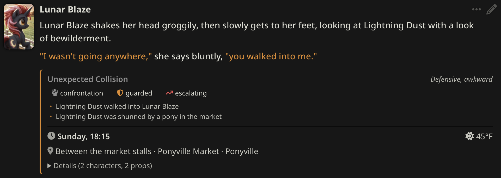
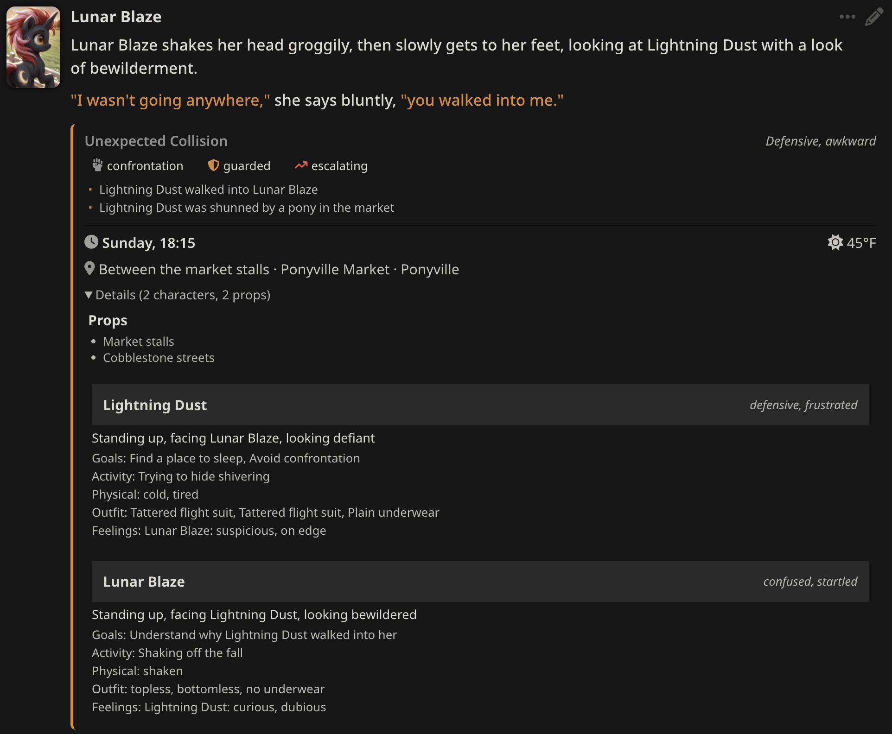

# BlazeTracker 🔥

A SillyTavern extension that uses LLM analysis to track and maintain scene state across roleplay conversations. Helps AI models stay consistent with physical positions, outfits, time of day, mood, and narrative tension.

## Examples

### Compact View



### Detailed View



## Installation

### Requirements
- SillyTavern 1.12.0 or later
- Git installed on your system

### Install via SillyTavern
1. Open SillyTavern
2. Go to **Extensions** → **Install Extension**
3. Paste the repository URL:
   ```
   https://github.com/lunarblazepony/BlazeTracker
   ```
4. Click **Install**
5. Reload SillyTavern

### Manual Installation
1. Navigate to your SillyTavern installation
2. Go to `data/<user>/extensions/` (or `public/scripts/extensions/third-party/` for all users)
3. Clone the repository:
   ```bash
   git clone https://github.com/lunarblazepony/BlazeTracker
   ```
4. Restart SillyTavern
5. See Configuration to get started

## Features

### Scene State Tracking
- **Time**: Full narrative date and time tracking (year, month, day, hour, minute, day of week) with intelligent inference from scene context
- **Location**: Area, place, position, nearby props
- **Climate**: Weather and temperature (informed by time/season)
- **Characters**: Position, activity, mood, goals, physical state, outfit (head, jacket, torso, legs, underwear, socks, footwear), and dispositions toward other characters

### Intelligent Time Tracking
BlazeTracker uses a dedicated LLM call to track narrative time:
- **Initial extraction**: Infers date/time from scene context (weather, lighting, activities, seasonal clues)
- **Delta tracking**: Detects time jumps in subsequent messages ("an hour later", "the next morning", travel time, etc.)
- **Leap detection**: Prevents "double sleep" issues where parallel actions are interpreted as sequential (e.g., two characters sleeping doesn't advance time twice)
- **Automatic day-of-week**: Calculated from the date, so it's always consistent

### Scene Context
- **Topic**: What the scene is about (3-5 words)
- **Tone**: Emotional quality of the scene (2-3 words)
- **Tension**: 
  - Level: relaxed → aware → guarded → tense → charged → volatile → explosive
  - Direction: escalating, stable, or decreasing
  - Type: confrontation, intimate, vulnerable, celebratory, negotiation, suspense, conversation
- **Recent Events**: Up to 5 significant events affecting the narrative (secrets discovered, injuries, intimacy changes, etc.)

### Smart Extraction
- Extracts state changes from messages using your configured LLM
- Delta-based updates - only changes what actually changed
- Grounded in character cards and lorebook for accuracy
- Swipe-aware storage - each swipe maintains its own state

### Context Injection
- Automatically injects current scene state into the prompt
- Full date/time included (e.g., "Monday, June 15th, 2024 at 2:30 PM")
- Helps the AI maintain consistency without manual reminders

### Visual Display
- Inline state display below (or above) each message
- Date and time shown in compact format (e.g., "Sun, Dec 15 2024, 17:00")
- Climate with weather icons (☀️ sunny, ☁️ cloudy, ❄️ snowy, 🌧️ rainy, 💨 windy, ⛈️ thunderstorm)
- Tension visualized with icons (☕ relaxed, 👁 aware, 🛡 guarded, 😬 tense, ⚡ charged, 🔥 volatile, 💥 explosive)
- Direction indicators (📈 escalating, ➖ stable, 📉 decreasing)
- Expandable details for characters and props
- Loading indicator during extraction

### Manual Editing
- Full state editor UI
- Edit any field: date, time, location, characters, outfits, tension, events
- Date picker with automatic day-of-week calculation
- Add/remove characters and dispositions

## Configuration

Open the BlazeTracker settings panel in SillyTavern's Extensions menu.

### Connection Profile
- You will need to choose a connection profile to use BlazeTracker
- The easiest way to get a connection profile is to go to the connection menu, then at the top, press the 'Add' button, it will auto-populate the chat template etc from your current settings.
- **IMPORTANT**: Make sure to uncheck 'Start reply with' if you have it set up for your roleplays.
- You will need to refresh the page after creating a Connection Profile for it to show up in the Extensions settings.

### Auto-Extraction Mode
- **Off**: Manual extraction only (click 🔥 button)
- **Responses**: Auto-extract after AI messages
- **Inputs**: Auto-extract after your messages
- **Both**: Auto-extract after all messages

### Max messages to Include
The extension will automatically include X most recent messages since the last state, this allows you to set a maximum.

### Max Response Tokens
Number of tokens for the state response, default is 4,000. A block with 2 characters is usually about 1000 tokens.

### State Display Position
- **Above message**: Show the state block above the message
- **Below message**: Show the state block below the message

### Enable Time Tracking
When enabled, BlazeTracker makes an additional lightweight LLM call per message to track narrative time:
- First message: Extracts full date/time from scene context
- Subsequent messages: Extracts time delta (how much time passed)

This is a fast operation (~100-150 tokens in, ~20 tokens out) but can be disabled if you don't need time tracking or want to reduce API calls.

### Leap Threshold (minutes)
Prevents the "double sleep" problem. If two consecutive messages both contain time jumps larger than this threshold, the second jump is capped.

**Example**: Character A sleeps (8 hours). Character B also sleeps (8 hours). Without leap detection, this would advance time 16 hours. With a 20-minute threshold, the second sleep is capped to 20 minutes since it's assumed to be parallel action.

Default: 20 minutes. Increase if your RP legitimately has back-to-back large time skips.

## Usage

### Automatic Mode
With auto-extraction enabled, state is extracted after each message. A loading indicator shows while extraction is in progress.

#### Note: Manual Editing
I usually like to edit the state after the first assistant message, since it will make a bunch of assumptions that may or may not be true for your roleplay. This isn't required, but setting the initial state manually will help to keep the roleplay coherent.

### Manual Mode
1. Click the 🔥 button in the '...' menu on any message to extract state
2. Click the ✏️ button in the '...' menu to manually edit state

### Swipes
Each swipe maintains its own state. When you swipe to a new response, BlazeTracker will:
1. Show the existing state if previously extracted
2. Auto-extract if enabled and no state exists
3. Update the injected context to match the current swipe

## How It Works

1. **Time Extraction**: If enabled, a lightweight LLM call extracts the narrative date/time (initial) or time delta (subsequent)
2. **State Extraction**: Recent messages plus the previous state are sent to your LLM with a structured extraction prompt, including the current narrative time for climate inference
3. **Delta Processing**: The LLM returns only what changed, which is merged with the previous state
4. **Storage**: State is stored in `message.extra.blazetracker` for each message/swipe
5. **Injection**: The most recent state is formatted and injected into the prompt context
6. **Display**: React components render the state inline with each message

## Building from Source

```bash
# Clone the repository
git clone https://github.com/lunarblazepony/BlazeTracker
cd BlazeTracker

# Install dependencies
npm install

# Build
npm run build

# Output appears in dist/
```

## Troubleshooting

### State not extracting
- Check that your API is connected and working
- Check browser console for errors

### Old state showing after swipe
- This is usually a timing issue - state should update within a moment
- Try clicking the extract button manually

### Time seems wrong
- The initial time is inferred from context clues (weather, lighting, activities). If the scene doesn't have clear indicators, it may guess wrong.
- Use the editor to correct the initial date/time - subsequent deltas will be applied correctly from there.

### Double time advancement
- If time is advancing too fast (e.g., both characters sleeping advances time twice), try lowering the Leap Threshold setting.
- The default 20 minutes works well for most scenarios.

### Extension not appearing
- Ensure you have the latest SillyTavern version
- Check that the extension is enabled in Extensions → Manage Extensions

## License

Copyright (c) 2026 Lunar Blaze

Permission is hereby granted, free of charge, to any person obtaining a copy
of this software and associated documentation files (the "Software"), to deal
in the Software without restriction, including without limitation the rights
to use, copy, modify, merge, publish, distribute, sublicense, and/or sell
copies of the Software, and to permit persons to whom the Software is
furnished to do so, subject to the following conditions:

The above copyright notice and this permission notice shall be included in all
copies or substantial portions of the Software.

THE SOFTWARE IS PROVIDED "AS IS", WITHOUT WARRANTY OF ANY KIND, EXPRESS OR
IMPLIED, INCLUDING BUT NOT LIMITED TO THE WARRANTIES OF MERCHANTABILITY,
FITNESS FOR A PARTICULAR PURPOSE AND NONINFRINGEMENT. IN NO EVENT SHALL THE
AUTHORS OR COPYRIGHT HOLDERS BE LIABLE FOR ANY CLAIM, DAMAGES OR OTHER
LIABILITY, WHETHER IN AN ACTION OF CONTRACT, TORT OR OTHERWISE, ARISING FROM,
OUT OF OR IN CONNECTION WITH THE SOFTWARE OR THE USE OR OTHER DEALINGS IN THE
SOFTWARE.

## Contributing

Contributions welcome! Please open an issue or PR on GitHub.

## Acknowledgements

- [SillyTavern](https://github.com/SillyTavern/SillyTavern) team for the extensible platform
- [WTracker](https://github.com/bmen25124/SillyTavern-WTracker) for exposing me to the idea of a tracker
- Font Awesome for icons
